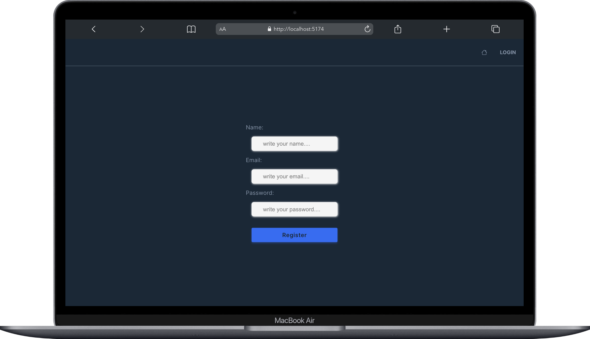
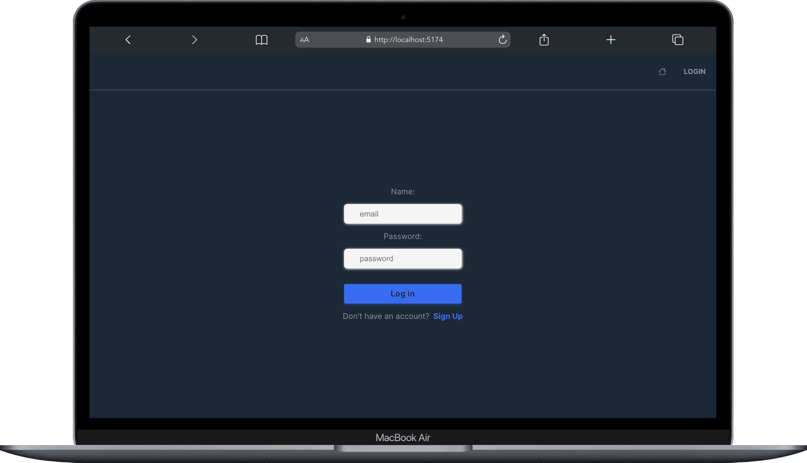
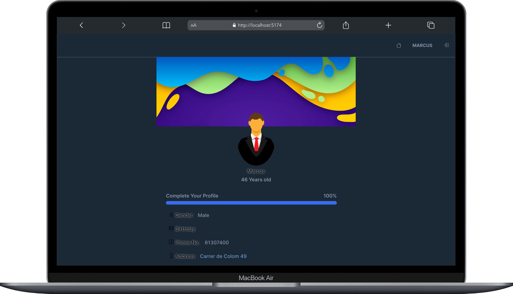
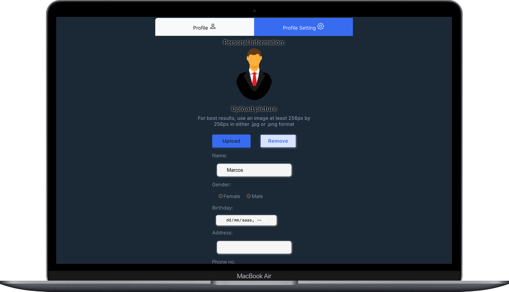
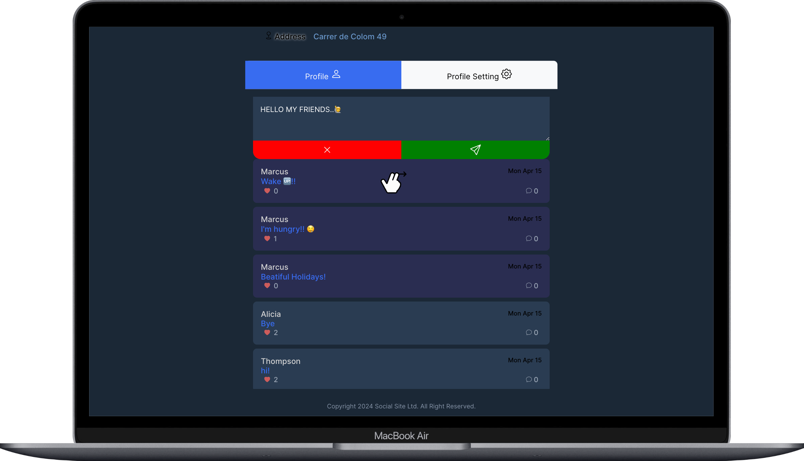
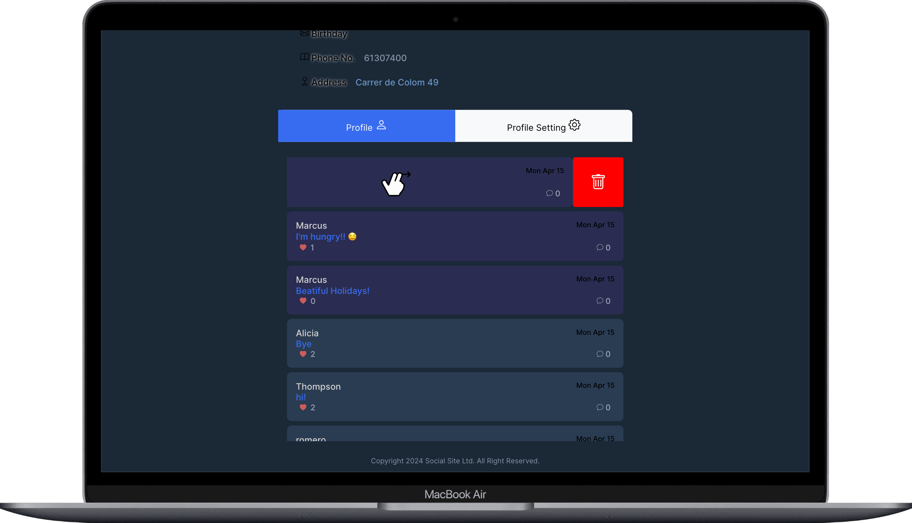
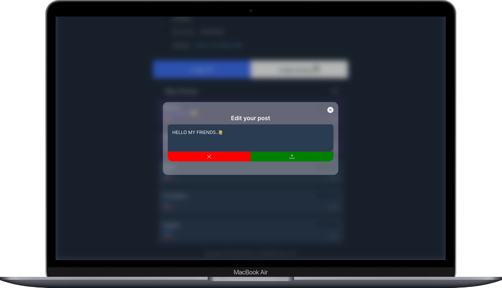
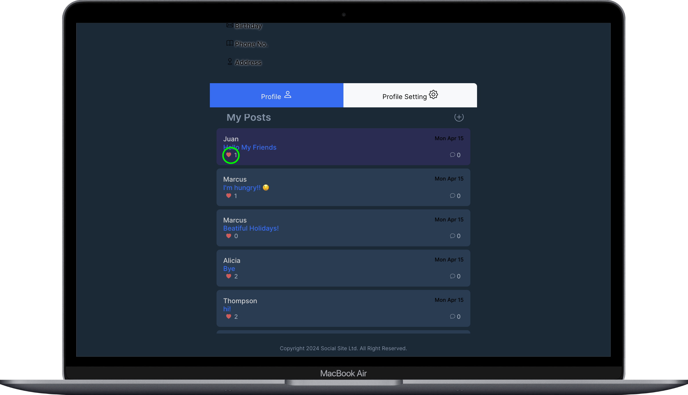
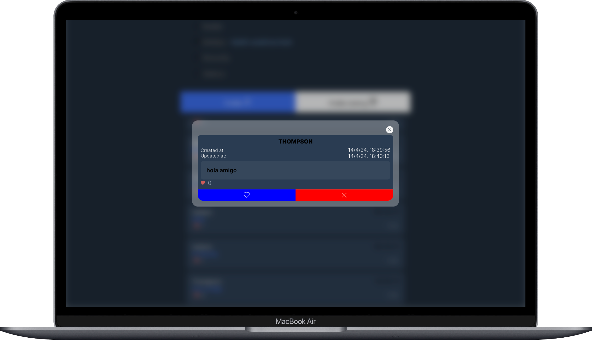

### Social Media Frontend

---

 <svg xmlns="http://www.w3.org/2000/svg" width="16" height="16" fill="darkblue" class="bi bi-facebook" viewBox="0 0 16 16">
  <path d="M16 8.049c0-4.446-3.582-8.05-8-8.05C3.58 0-.002 3.603-.002 8.05c0 4.017 2.926 7.347 6.75 7.951v-5.625h-2.03V8.05H6.75V6.275c0-2.017 1.195-3.131 3.022-3.131.876 0 1.791.157 1.791.157v1.98h-1.009c-.993 0-1.303.621-1.303 1.258v1.51h2.218l-.354 2.326H9.25V16c3.824-.604 6.75-3.934 6.75-7.951"/>
</svg>

<h4> Social Media </h4>

---

---

[![GITHUB]][github-url][![DOCKER]][docker-url]
[![Mongo][MongoDB]][MongoDB-url][![Node][Node.JS]][Node.JS-url][![Express][Express.js]][Express.js-url]![REACT]![JAVASCRIPT]<a href="https://developer.mozilla.org/es/docs/Web/CSS">[![JWT]][JWT-url]

[JWT]: https://img.shields.io/badge/JWT-black?style=for-the-badge&logo=JSON%20web%20tokens
[JWT-url]: https://jwt.io/
[Express.js]: https://img.shields.io/badge/express.js-%23404d59.svg?style=for-the-badge&logo=express&logoColor=%2361DAFB
[Express.js-url]: https://expressjs.com/
[MongoDB]: https://img.shields.io/badge/MongoDB-%234ea94b.svg?style=for-the-badge&logo=mongodb&logoColor=white
[MongoDB-url]: https://www.mongodb.com/es
[Node.JS]: https://img.shields.io/badge/node.js-026E00?style=for-the-badge&logo=node.js&logoColor=white
[Node.JS-url]: https://nextjs.org/
[MYSQL]: https://img.shields.io/badge/mysql-3E6E93?style=for-the-badge&logo=mysql&logoColor=white
[MYSQL-url]: https://www.mysql.com/
[GITHUB]: https://img.shields.io/badge/github-24292F?style=for-the-badge&logo=github&logoColor=white
[github-url]: https://www.github.com/
[GIT]: https://img.shields.io/badge/git-F54D27?style=for-the-badge&logo=git&logoColor=white
[git-url]: https://git-scm.com/
[LINKEDIN]: https://img.shields.io/badge/linkedin-0274B3?style=for-the-badge&logo=linkedin&logoColor=white
[LINKEDIN-url]: https://www.linkedin.com/
[JS]: https://img.shields.io/badge/javascipt-EFD81D?style=for-the-badge&logo=javascript&logoColor=black
[js-url]: https://developer.mozilla.org/es/docs/Web/JavaScript
[DOCKER]: https://img.shields.io/badge/docker-2496ED?style=for-the-badge&logo=docker&logoColor=white
[docker-url]: https://www.docker.com/
[sequelize-url]: https://www.sequelize.org/
[gmail-url]: https://www.gmail.com/
[JWT]: https://img.shields.io/badge/JWT-black?style=for-the-badge&logo=JSON%20web%20tokens
[JWT-url]: https://jwt.io/

</a>

[JAVASCRIPT]: https://img.shields.io/badge/JavaScript-F7DF1E?style=for-the-badge&logo=javascript&logoColor=black
[REACT]: https://img.shields.io/badge/React-20232A?style=for-the-badge&logo=react&logoColor=61DAFB
[MYSQL]: https://img.shields.io/badge/mysql-3E6E93?style=for-the-badge&logo=mysql&logoColor=white
[MYSQL-url]: https://www.mysql.com/
[GITHUB]: https://img.shields.io/badge/github-24292F?style=for-the-badge&logo=github&logoColor=white
[github-url]: https://www.github.com/
[GIT]: https://img.shields.io/badge/git-F54D27?style=for-the-badge&logo=git&logoColor=white
[git-url]: https://git-scm.com/
[DOCKER]: https://img.shields.io/badge/docker-2496ED?style=for-the-badge&logo=docker&logoColor=white
[docker-url]: https://www.docker.com/

Very thanks for interest in my project. Is first design of Social Media Backend ( the fifth project with Geekshubs Academy of the Full Stack Development Bootcamp 🚀).

---

### Description

The project consists of creating a social network where users can register, access the network and interact with each other.
Users can also follow or unfollow other users, write comments on their profiles or posts.

---

### Develop

Is a SPA (single-page application) with react router dom to organize the routes.
The frontend is already connected to mongoDB data base created in Social Media Backend.
The data showed or the new users create are created in existing mongoDB data base.

#### First Structure (Routes)

- Users
- Posts

  Thats tables have relation between us.

---

#### Develop

REST API design for FRONTEND

Create two main tables, User and Post. They are related to each other. The fields of the Post table are: post id, user id, comments, name, and likes.
The User table fields are: name, email, password, role, following, and followers.

---

#### Views

#### Computer Device 💻

##### Register page

`http://localhost:5174/register`

---

#### Login page

`http://localhost:5174/login`

---

#### Home page

`http://localhost:5174`

---

#### Editable User profile

`http://localhost:5174/profile` or `http://localhost:5174`

---

#### User Post List

`http://localhost:5174`

---

#### New Post

`http://localhost:5174`

---

#### Delete Post

`http://localhost:5174`

---

#### Edit Post

`http://localhost:5174`

---

#### Like Post

`http://localhost:5174`

---

#### Post Detail

`http://localhost:5174`

---

#### Mobil device 📱

### Next steps

Continue build components, buttons and inputs to from respective end points created in the backend
Add Redux to use a global state to binding data of components.
Add testing.

---
