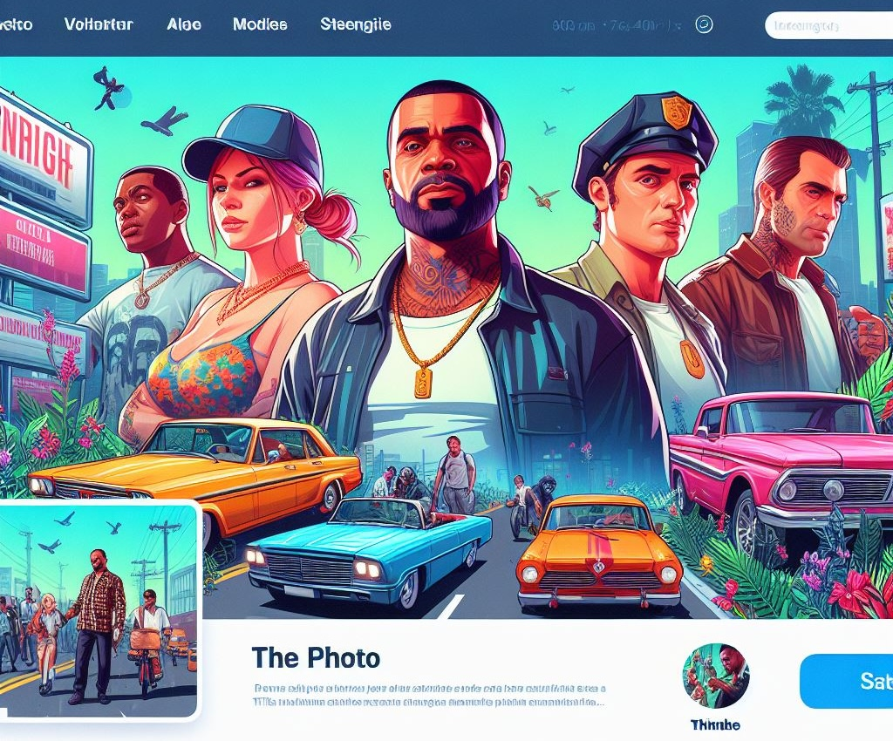
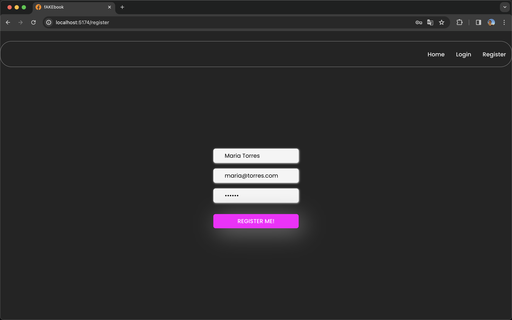
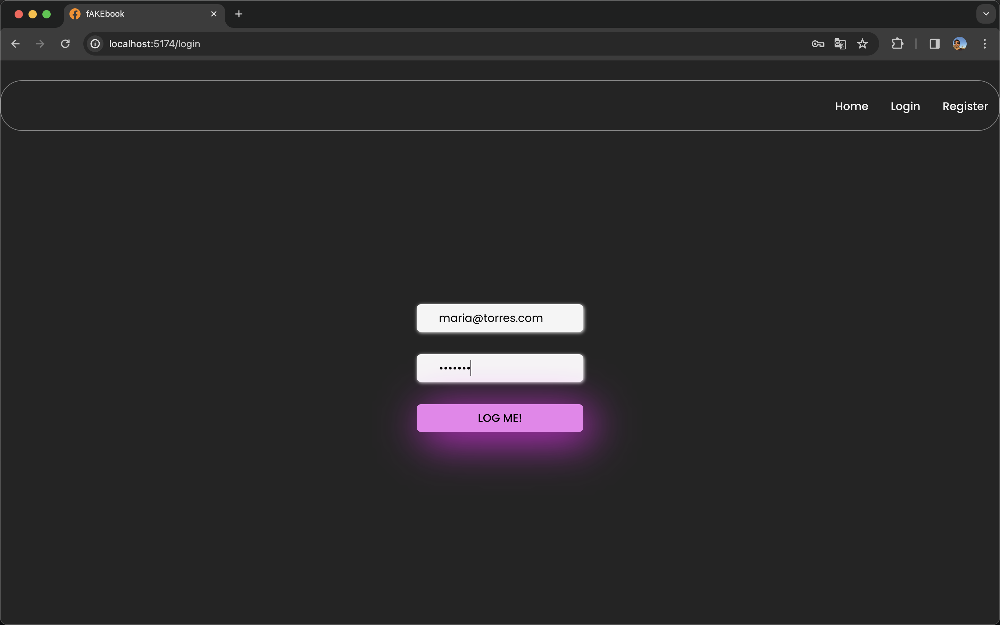
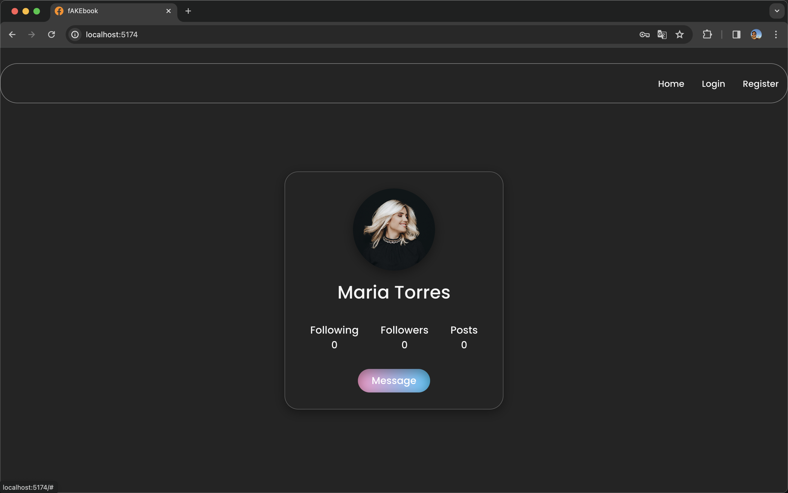

### Social Media Frontend

---

 <svg xmlns="http://www.w3.org/2000/svg" width="16" height="16" fill="darkblue" class="bi bi-facebook" viewBox="0 0 16 16">
  <path d="M16 8.049c0-4.446-3.582-8.05-8-8.05C3.58 0-.002 3.603-.002 8.05c0 4.017 2.926 7.347 6.75 7.951v-5.625h-2.03V8.05H6.75V6.275c0-2.017 1.195-3.131 3.022-3.131.876 0 1.791.157 1.791.157v1.98h-1.009c-.993 0-1.303.621-1.303 1.258v1.51h2.218l-.354 2.326H9.25V16c3.824-.604 6.75-3.934 6.75-7.951"/>
</svg>

<h4> fakebook </h4>

---

---

Very thanks for interest in my project. Is first design of Social Media Backend ( the fifth project with Geekshubs Academy of the Full Stack Development Bootcamp 🚀).

---

#### Description

The project consists of creating a social network where users can register, access the network and interact with each other.
Users can also follow or unfollow other users, write comments on their profiles or posts.

---

#### Develop

Is a SPA (single-page application) with react router dom to organize the routes.
The frontend is already connected to mongoDB data base created in Social Media Backend
The data showed or the new users create are created in existing mongoDB data base.

#### Routes

---

##### Register page

`http://localhost:5173/register`

---

##### Login page

`http://localhost:5173/login`

---

##### Home page

`http://localhost:5173`

---

#### Next steps

Continue build components, buttons and inputs to from respective end points created in the backend
Add Redux to use a global state to binding data of components.
Add testing.

---
